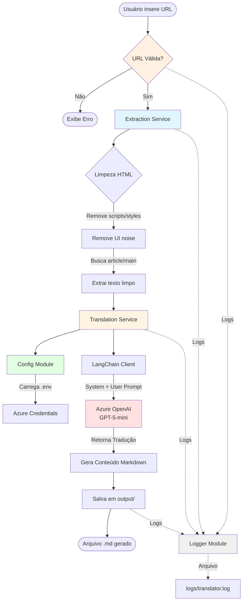

## Componentes

### 1. Extraction Service
- **Responsabilidade**: Scraping inteligente de artigos web.
- **Técnica**: Prioriza tags semânticas (`<article>`, `<main>`).
- **Limpeza**: Remove elementos de navegação, comentários e scripts.

### 2. Translation Service
- **Engine**: Azure OpenAI via LangChain.
- **Prompt**: System message especializado em terminologia técnica.
- **Output**: Markdown formatado.

### 3. Config Module
- **Segurança**: Gerencia credenciais via `.env`.
- **Flexibilidade**: Suporta diferentes modelos e versões de API.

### 4. Logger Module
- **Observabilidade**: Logging estruturado com timestamps.
- **Destinos**: Console (stdout) + arquivo (`logs/translator.log`).
- **Níveis**: INFO para fluxo normal, ERROR para falhas.

## Fluxo de Dados

1. URL → Scraper (HTML bruto)
2. Scraper → Translator (Texto limpo)
3. Translator → Azure OpenAI (Texto + Prompt)
4. Azure → Translator (Tradução)
5. Translator → Filesystem (Arquivo .md)
